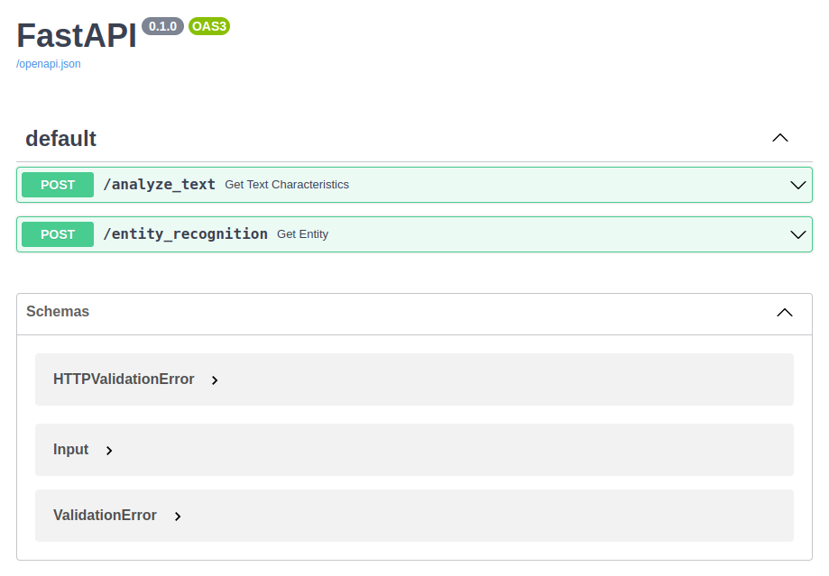
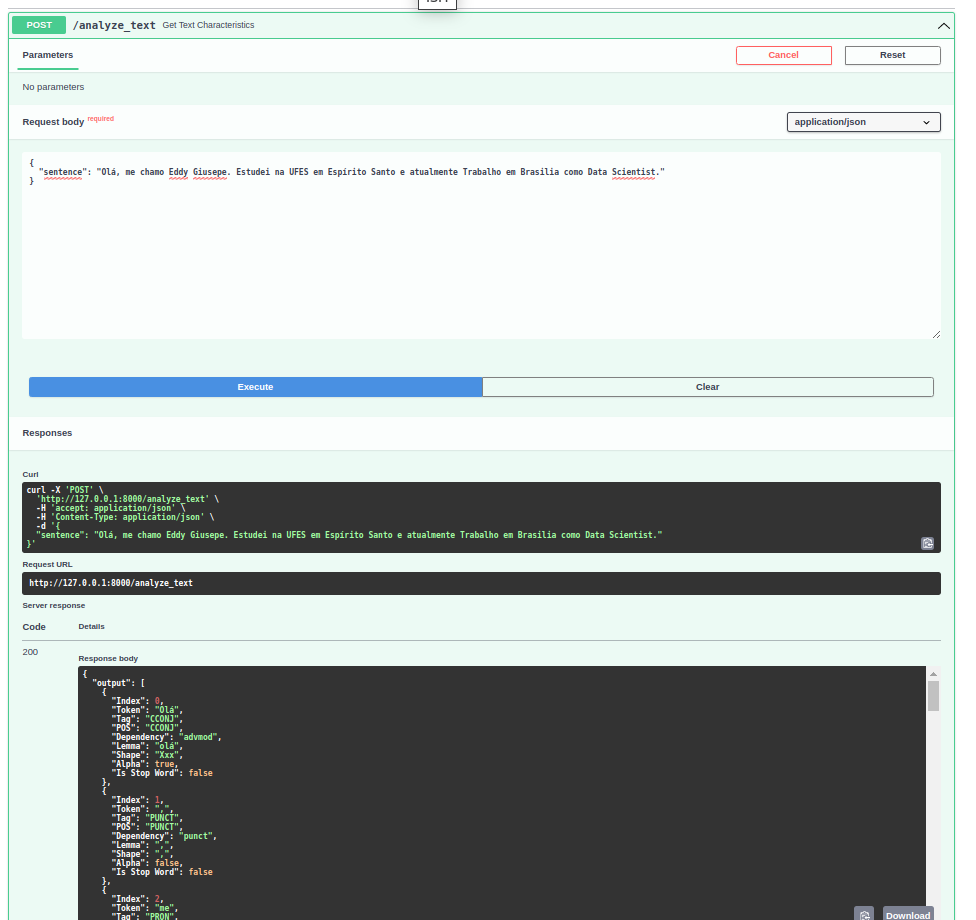
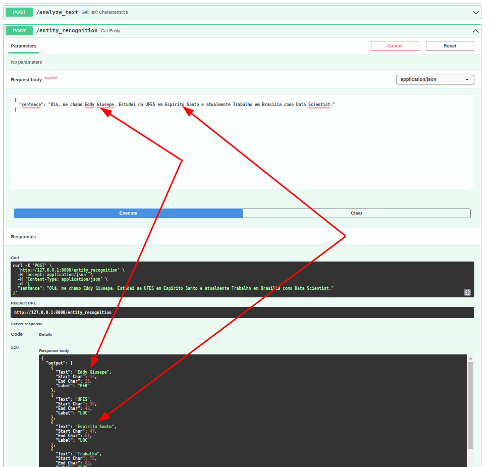

Data Scientist.: Dr.Eddy Giusepe Chirinos Isidro

# Visualizando os dois POST no Swagger UI

O primeiro endpoint fará uma solicitação de postagem (`POST`) para `/analyze_text`

```
@app.post("/analyze_text")
def get_text_characteristics(sentence_input: Input):
    document = en_core_web(sentence_input.sentence)
    output_array = []
    for token in document:
        output = {
            "Index": token.i, "Token": token.text, "Tag": token.tag_, "POS": token.pos_,
            "Dependency": token.dep_, "Lemma": token.lemma_, "Shape": token.shape_,
            "Alpha": token.is_alpha, "Is Stop Word": token.is_stop
        }
        output_array.append(output)
    return {"output": output_array}
```

* Temos um decorador de postagens que nos leva aonde precisamos ir.

* Aceita `sentence_input` que é do tipo `Input` (do nosso modelo)

* Ele carrega no documento `spaCy` (doc é uma convenção padrão, pode ser chamado do que você quiser.

* Temos uma matriz de saída que será anexada a

* Nós iteramos sobre os tokens no documento

* Procuramos um índice, a própria palavra (`token`), tag, part-of-speech, dependência, lemma, shape, alpha e se é uma `stop word`.

* Anexamos isso ao array
* E return   





Depois adicionamos mais um `endpoint` para o reconhecimento de entidade nomeada (`NER`).

```
@app.post("/entity_recognition") 
def get_entity(sentence_input: Input): 
    document = en_core_web(sentence_input.sentence) 
    output_array = [] 
    for token in document.ents: 
        output = { 
            "Text": token.text, "Start Char": token.start_char, 
            "End Char": token.end_char, "Label": token.label_ 
        } 
        output_array.append(output) 
    return {"output": output_array}
```

* Temos outro decorador de postagens (`POST`)

* Aceita `Input`

* Inicialize nosso documento (ou doc)

* Temos nossa matriz de saída que podemos anexar (`append`)

* Nós iteramos sobre nossos `document.ents` (`entities`)

* E geramos o próprio token (texto) e o `caractere inicial` + `final` e o rótulo (`Label`).

* Anexamos ao nosso array de saída e o return.




É isso Pessoal!!


Thanks God!